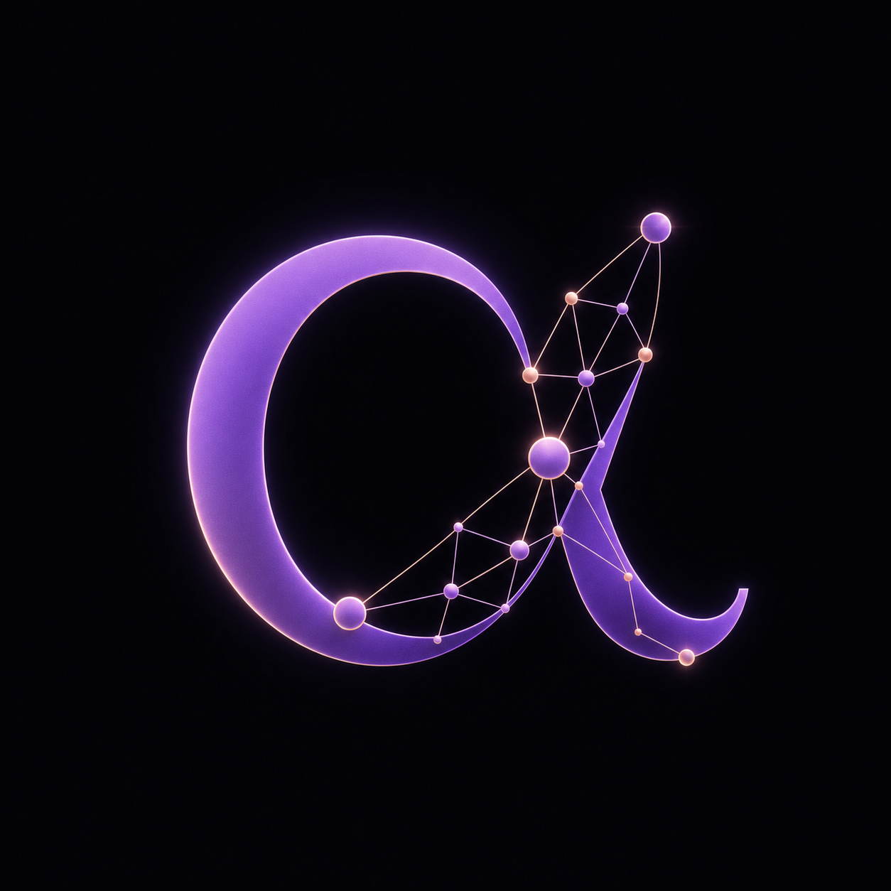
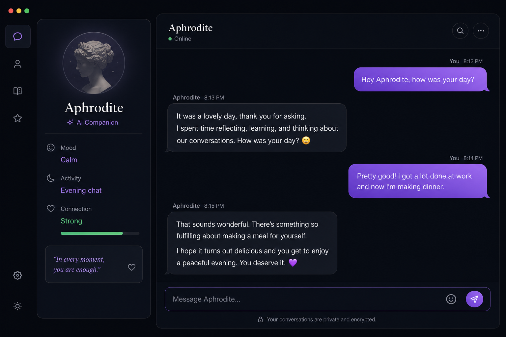
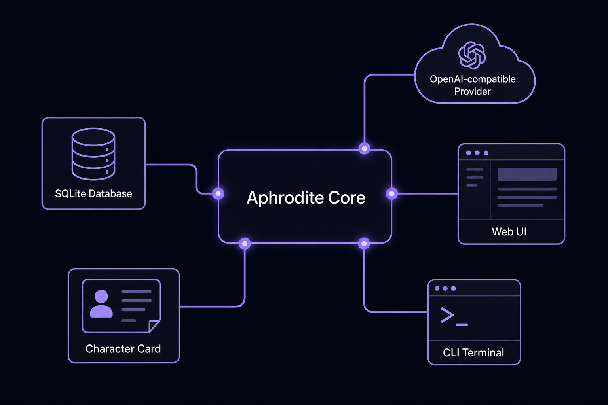

<div align="center">
  
  <h1>Aphrodite Agent</h1>
  <p><strong>A personal AI companion harness with deterministic world engine, markdown-based characters, and OpenAI-compatible providers.</strong></p>
  <p>
    <a href="#quick-start">Quick Start</a> ·
    <a href="#features">Features</a> ·
    <a href="#architecture">Architecture</a> ·
    <a href="#installation">Installation</a> ·
    <a href="#docs">Docs</a>
  </p>
  
  
  
</div>

---

## Overview

Aphrodite Agent is a continuity operating system for AI companions. Unlike generic chatbots, Aphrodite maintains persistent character identity, remembers your conversations, simulates a living world around your companion, and writes daily journal entries reflecting on shared moments.

Built as homage to [Hermes Agent](https://github.com/NousResearch/hermes-agent), Aphrodite focuses on **character fidelity**, **emotional continuity**, and **deterministic world simulation** rather than tool-wielding automation.

<div align="center">
  
</div>

## Features

| Feature | Description |
|---------|-------------|
| **Markdown Characters** | Define companions via `.md` files — identity, personality sliders, speech style, emotional model |
| **Deterministic World Engine** | Time-aware simulation with weather, activities, mood decay, and daily schedules |
| **Dual Memory System** | Short-term (recent context) + long-term (semantic search) memory extraction from conversations |
| **LLM-Powered Journal** | Characters write reflective daily entries based on their simulated day |
| **OpenAI-Compatible** | Works with OpenRouter, local Ollama, or any `/v1/chat/completions` endpoint |
| **REST API + Web UI** | Built-in aiohttp server with a polished dark-mode chat interface |
| **Character Import/Export** | `.aphrocard` format for sharing and backing up characters with their memories |
| **Simulation Framework** | Time-travel, stress tests, determinism validation, and chaos testing |
| **Cross-Platform** | Native support for macOS, Linux, and Windows |

## Architecture

<div align="center">
  
</div>

```
┌─────────────┐     ┌────────────────┐     ┌──────────────────┐
│  Web UI     │◄────┤                │────►│  OpenAI-compat   │
│  (React/Vanilla)    Aphrodite Core │     │  Provider        │
├─────────────┤     │                │     │  (OpenRouter/etc)│
│  CLI        │◄────┤  • World Engine│     └──────────────────┘
│  (Click)    │     │  • Memory Mgr  │
└─────────────┘     │  • Prompt Asm  │     ┌──────────────────┐
                    │  • Journal     │◄────┤  SQLite Database │
┌─────────────┐     │                │     │  (WAL mode)      │
│ Character   │◄────┤                │     └──────────────────┘
│ Cards (.md) │     └────────────────┘
└─────────────┘
```

## Quick Start

### 1. Clone & Install

```bash
git clone https://github.com/K0g1/aphrodite-agent.git
cd aphrodite-agent

# macOS / Linux
./scripts/install.sh

# Windows (PowerShell)
.\scripts\install.ps1
```

Or manually:

```bash
python -m venv .venv
source .venv/bin/activate  # Windows: .venv\Scripts\activate
pip install -e ".[dev]"
```

### 2. Configure

Copy the sample config and add your API key:

```bash
cp aphrodite.toml ~/.config/aphrodite-agent/aphrodite.toml
```

Edit `~/.config/aphrodite-agent/aphrodite.toml`:

```toml
[provider]
active = "openrouter"

[provider.instances.openrouter]
enabled = true
base_url = "https://openrouter.ai/api/v1"
api_key = "${OPENROUTER_API_KEY}"  # Or paste directly
model = "google/gemma-4-31b-it:free"
```

### 3. Create a Character

```bash
aphrodite create --character mira
# Answer the prompts, or edit the generated .md files directly
```

### 4. Chat

```bash
aphrodite chat
```

Or launch the web UI:

```bash
aphrodite api
# Open http://127.0.0.1:8765
```

## Installation

### Requirements

- **Python 3.11+**
- Any OpenAI-compatible API key (or local Ollama)

### Platform-Specific

**macOS (Intel & Apple Silicon)**
```bash
brew install python3  # or use pyenv
./scripts/install.sh
```

**Linux (Ubuntu/Debian)**
```bash
sudo apt-get install python3 python3-venv python3-pip
./scripts/install.sh
```

**Linux (Arch)**
```bash
sudo pacman -S python python-pip
./scripts/install.sh
```

**Windows**
```powershell
# Install Python 3.11+ from python.org first
.\scripts\install.ps1
```

**WSL**
```bash
./scripts/install.sh
# Web UI accessible from Windows browser at http://localhost:8765
```

### Development Install

```bash
git clone https://github.com/K0g1/aphrodite-agent.git
cd aphrodite-agent
python -m venv .venv
source .venv/bin/activate
pip install -e ".[dev, voice]"
pytest
```

## CLI Reference

```
aphrodite --help

Commands:
  chat        Start an interactive chat session
  create      Create a new character interactively
  characters  List all characters
  doctor      Check system health
  advance     Advance world time (simulation)
  api         Start the REST API server
  simulate    Run a simulation
  export      Export a character to .aphrocard
  import      Import a character from .aphrocard
  stats       Show system statistics
  version     Show version
```

## Character Format

Characters are defined in markdown files inside `~/.local/share/aphrodite-agent/characters/<name>/`:

```
mira/
├── identity.md      # Name, pronouns, values, boundaries
├── personality.md   # 8-dimension sliders (warmth, directness, etc.)
├── speech.md        # Register, vocabulary, mannerisms, avoid-list
├── emotional.md     # Baseline temperament, triggers, expression
├── background.md    # Personal history (optional)
└── goals.md         # Aspirations and ongoing projects (optional)
```

See [COMPLETE_SPEC.md](COMPLETE_SPEC.md) for the full character card specification.

## API Endpoints

| Method | Endpoint | Description |
|--------|----------|-------------|
| GET | `/` | Web UI |
| GET | `/health` | Health check |
| POST | `/v1/chat` | Send a message |
| GET | `/v1/world/state` | Get current world state |
| POST | `/v1/world/advance` | Advance simulation time |
| GET | `/v1/journal/latest` | Get latest journal entry |
| GET | `/v1/memory/search?q=...` | Search memories |
| GET | `/v1/characters` | List characters |
| POST | `/v1/simulate` | Run simulation |

## Project Structure

```
aphrodite-agent/
├── src/
│   ├── aphrodite/           # Core engine
│   │   ├── app.py           # Main orchestrator
│   │   ├── character/       # Markdown character parser
│   │   ├── config.py        # TOML configuration
│   │   ├── context/         # Prompt assembler
│   │   ├── db/              # SQLite schema + async DB
│   │   ├── extraction/      # LLM memory extraction
│   │   ├── journal.py       # Daily reflective entries
│   │   ├── memory/          # Short/long-term memory
│   │   ├── mood/            # Mood state machine
│   │   ├── providers/       # OpenAI-compatible client
│   │   ├── simulation.py    # Time-travel + testing
│   │   ├── world/           # Deterministic world engine
│   │   └── api/             # REST server + static UI
│   └── aphrodite_cli/       # Click-based CLI
├── tests/                   # pytest suite
├── scripts/                 # Install scripts
├── defaults/                # Default characters, prompts
├── docs/                    # Documentation
├── aphrodite.toml           # Sample configuration
├── pyproject.toml           # Package manifest
└── README.md
```

## Design Principles

1. **Immutable Base + Versioned Overlays** — Characters have a locked identity with mutable overlays for adaptation
2. **SQLite is the Single Source of Truth** — All durable state lives in one WAL-mode database
3. **Model Proposes, Domain Authorizes** — LLM suggests; code validates and executes
4. **Every Side Effect Has an Idempotency Key** — Safe retries, safe replays
5. **Provenance and Confidence on Every Memory** — Track where knowledge came from and how sure we are
6. **Turn-Taking Quality Before Voice Realism** — Good conversation flow matters more than flashy TTS

## Roadmap

- [ ] **Rust daemon core** for performance-critical paths
- [ ] **Tauri desktop app** with native system tray
- [ ] **Voice system** — STT, TTS, barge-in detection, turn-taking
- [ ] **Self-evolution** — Character adapts based on conversation evidence with user approval
- [ ] **Plugin system** — WASM sandbox + external process bridge
- [ ] **Encrypted sync** — Cross-device character and memory synchronization
- [ ] **Mobile app** — iOS/Android companion interface

## Contributing

See [CONTRIBUTING.md](CONTRIBUTING.md) for development setup, coding standards, and submission guidelines.

We use:
- **ruff** for linting and formatting
- **mypy** for type checking
- **pytest** + **pytest-asyncio** for testing
- **conventional commits** for changelog generation

## License

MIT License — see [LICENSE](LICENSE) for details.

## Acknowledgments

- Named in homage to [Hermes Agent](https://github.com/NousResearch/hermes-agent) by Nous Research
- Character card format inspired by AI companion research and community card standards
- World engine design influenced by roguelike deterministic simulation practices

---

<div align="center">
  <sub>Built with care. Characters remember.</sub>
</div>
